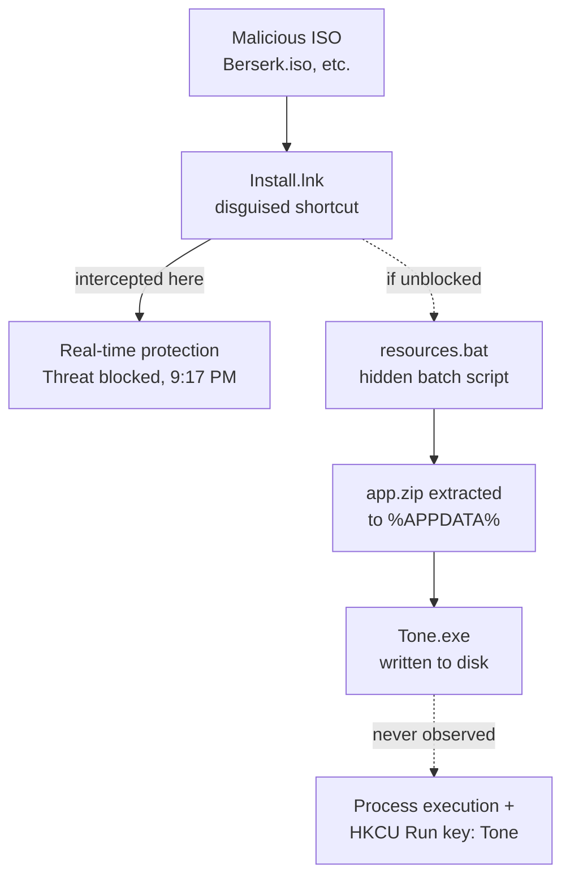

# Incident Report: TrojanClicker:Win32/Doplik ISO-Based Malware

Sep 24, 2026 · @nico

On 9/23/2026, my laptop threw up multiple TrojanClicker:Win32/Doplik and Trojan:BAT/Starter.G!lnk alerts after some ISO files I'd downloaded turned out to be malicious. I ran the full incident response process myself, start to finish — and forensic artifact analysis ultimately showed the payload never actually executed.

## Timeline of Events

Here's how the night actually unfolded, pieced together from Windows Security's Protection History. All times are local system time (Mountain Time), on 9/23/2026 unless otherwise noted.

| Time | Event | Detection Name | Status |
| --- | --- | --- | --- |
| 9:17 PM | Three shortcut/batch launches intercepted | Trojan:BAT/Starter.G!lnk | Threat blocked |
| 9:27 PM | ISO container files flagged across Downloads | TrojanClicker:Win32/Doplik.Q | Threat found - action needed |
| 9:28 PM | First cleanup attempt fails | — | Remediation incomplete |
| 9:30 PM | Additional ISO variant detected | TrojanClicker:Win32/Doplik.P | Threat quarantined |
| 9:32 PM | Detection extends to Recycle Bin copy | TrojanClicker:Win32/Doplik.Z | Threat quarantined |
| 9:36 PM | resources.bat / Tone.exe chain flagged directly | TrojanClicker:Win32/Doplik.Z | Threat found - action needed |
| 9:40 PM | Three more cleanup attempts fail; one final block | — | Remediation incomplete (x3), Threat blocked |
| 11:27 PM | Tone.exe reference persists in scan output | — | Remediation incomplete |
| Following day | Manual registry, Task Scheduler, and browser checks; offline + full AV scans | — | 0 threats found (both scans) |

**Note on timestamps:** Windows Security shows two time fields per entry — a history-entry header time and an internal "Date:" field — which occasionally differed by a few minutes in the raw screenshots. The table above uses the header time for consistency. For a byte-exact timeline, the Windows Defender Operational log (`Applications and Services Logs > Microsoft > Windows > Windows Defender > Operational`, Event IDs 1116/1117) is the authoritative source and was not exported for this incident.

## Infection Chain

I never had the malware's own `resources.bat` in hand, so the dotted paths above are reconstructed from a matching sample another victim posted online (see Sources) — showing what the script was built to do next: extract its payload and register persistence. My own forensic analysis below points to the chain getting cut off at the shortcut/script stage before any of that happened.

## Investigation & Remediation Checklist

| Area Checked | Method | Result |
| --- | --- | --- |
| Malicious ISO files | Manually deleted from Downloads | Removed |
| Recycle Bin | Emptied | Cleared |
| HKCU Run key | `HKEY_CURRENT_USER\Software\Microsoft\Windows\CurrentVersion\Run` reviewed entry by entry | Clean (legitimate Opera GX, Teams entries only) |
| HKLM Run key | `HKEY_LOCAL_MACHINE\SOFTWARE\Microsoft\Windows\CurrentVersion\Run` + WOW6432Node mirror | Clean |
| Task Scheduler | Full Task Scheduler Library reviewed; one task investigated in depth via its Actions tab | Clean — sole suspicious-looking entry (`ZoomUpdateTaskUser-<SID>`) confirmed as the legitimate Zoom auto-updater, pointing to `%APPDATA%\Zoom\bin\Zoom.exe --action=UpdateSchedule` |
| `%APPDATA%\Roaming` / `%LOCALAPPDATA%` | Manually searched for `Tone`, `Healthy`, `Diet`, `chrome_test` folders (names drawn from Defender alerts and public research) | Not found |
| Browser extensions | Reviewed installed extensions in Chrome, Edge, and Opera GX | Clean |
| Offline scan (Microsoft Defender) | Full offline scan, run outside the live OS | 0 threats found |
| Full scan (Microsoft Defender) | Full in-OS scan | 0 threats found |

A stale **"Remediation incomplete"** notice remained visible in Protection History after cleanup. This is expected: Protection History is a static, append-only log (Microsoft's own documentation notes entries are retained for roughly two weeks and are not retroactively updated by later scans), so an old entry persisting alongside a clean current scan is not a contradiction — the current scan result is the authoritative live-state signal.

## Additional Investigation Notes

**Why the threat count grew during removal.** The initial scan reported only 3 threats, but the count grew substantially once removal was attempted. Two factors account for this rather than reinfection: (1) Detection paths in later alerts showed increasingly granular nesting — `ISO → app.zip → Healthy/Healthy.exe → open.html`, `ISO → app.zip → Diet/Diet.exe`, `ISO → app.zip → Tone/Tone.exe` — suggesting Defender's initial pass flagged the outer ISO containers by signature without fully unpacking them, and only enumerated the individual components inside (the `.lnk`, the `.bat`, each dropped `.exe`) once a removal action forced it to open and process each container. (2) Six separate, near-identical ISO files existed in Downloads (Berserk.iso, Honor Society.iso, The Goldfinch.iso, The Goldfinch (1).iso, and two files named "Your File Is Ready To Download"), each a distinct copy of the same lure carrying the same payload — so what looked like one threat multiplying was largely multiple independent copies being processed in sequence.

**Why the offline scan wouldn't launch.** The Microsoft Defender Offline scan could not be triggered through Windows Security after in-app removal attempts failed. The exact cause was not conclusively isolated; the most plausible explanations, roughly in order of likelihood, are a pending restart from an earlier incomplete removal blocking a new scan from being scheduled, the offline scan's own boot-time scheduled task failing to register cleanly given the number of concurrent detections in flight, or a UI confirmation prompt requiring a second click that wasn't obvious from the interface. Rather than continue troubleshooting this path, remediation proceeded with Malwarebytes, which does not depend on the same scheduling mechanism.

## Forensic Execution Analysis

Defender's alerts told me `Tone.exe` had been written to disk, but that's not the same as it running. I wanted to know for certain, so I checked two independent OS-level artifacts:

**Prefetch** (`C:\Windows\Prefetch`) — Windows creates a `.pf` file the first time an executable runs, and the feature was confirmed enabled prior to checking (`HKLM\SYSTEM\CurrentControlSet\Control\Session Manager\Memory Management\PrefetchParameters\EnablePrefetcher = 3`, i.e. both application and boot prefetching active). Other recently-run programs had `.pf` files present, confirming the folder was actively logging. **No `TONE.EXE-*.pf` file was found.**

**Amcache** (`C:\Windows\AppCompat\Programs\Amcache.hve`) — a registry hive that independently tracks binary execution even in some cases Prefetch misses. Parsed with **AmcacheParser** (Eric Zimmerman's forensic tooling). **No entry for Tone.exe was found.**

Both artifacts are maintained by different Windows subsystems and neither showed any trace of the payload running. This is consistent with the timeline: the earliest detection (`Trojan:BAT/Starter.G!lnk`, 9:17 PM) was logged as **"Threat blocked"** rather than **"quarantined,"** which typically distinguishes prevention from cleanup-after-the-fact — supporting the conclusion that real-time protection intercepted the `.lnk`/`resources.bat` chain before its final `start Tone.exe` command executed.

## Findings & Conclusion

I'm confident the device is clean — not from one check, but from several independent sources all agreeing:

1. Two full-system antivirus scans (one offline, one in-OS) returned **0 threats**.
2. Every known persistence mechanism for this malware family — registry Run keys (HKCU and HKLM), Task Scheduler, dropped-file locations, and browser extensions — was checked manually and found clean.
3. Two independent forensic artifacts (Prefetch, Amcache) agree the malicious payload (`Tone.exe`) was never executed as a process, despite being written to disk.

**Most likely sequence:** the ISO was opened and its shortcut triggered the `resources.bat` script, which began extracting its payload. Microsoft Defender's real-time protection intercepted the chain at this stage — the first-ever detection was logged as "blocked," not "quarantined" — before the script's final command could launch `Tone.exe`. Subsequent Defender alerts and "Remediation incomplete" notices reflect the engine repeatedly flagging the dropped-but-inert files across several scans, not renewed execution.

## Attribution & Open Questions

**Family naming is inferred, not confirmed.** Microsoft's detection names (`TrojanClicker:Win32/Doplik`, `Trojan:BAT/Starter.G!lnk`) do not themselves state a malware family. The `Install.lnk → resources.bat → app.zip → Tone.exe` chain matches published technical writeups on **ChromeLoader** (also called Choziosi Loader) closely — including the exact filenames — but no Microsoft source explicitly maps "Doplik" to "ChromeLoader." Different AV vendors commonly assign different names to the same underlying malware, so this remains a pattern-match inference rather than a confirmed vendor mapping. The delivery vector — a pirated-anime download site — matches documented ChromeLoader distribution channels, which commonly bundle the malware with pirated movies, TV, and games, adding some circumstantial support to the pattern match.

**Trigger mechanism is unresolved.** No manual file-open was reported the night of the incident, and UserAssist (`HKCU\Software\Microsoft\Windows\CurrentVersion\Explorer\UserAssist`) was not conclusively checked to confirm whether the `.lnk` was double-clicked through Explorer. How the chain was initiated — manual click, auto-mount behavior, or another mechanism — was not fully established.

**File-age discrepancy (largely resolved).** The ISO files were reportedly downloaded from an untrustworthy anime streaming/download site sometime between roughly 2020 and 2022. The exact `resources.bat`/`Tone.exe` technique documented here first appears in public research around early 2022, so a download toward the later end of that window is broadly consistent with this malware family's known emergence. A download earlier in the window would still predate it — in that case, the hosting site likely substituted a newer malicious payload behind an older download link, a known pattern on pirated-media sites. The exact download date was not independently verified against file system timestamps.

## Sources

- [ChromeLoader: New Stubborn Malware Campaign](https://unit42.paloaltonetworks.com/chromeloader-malware/) — Palo Alto Networks Unit 42; technical breakdown of the ISO → LNK → resources.bat → Tone.exe chain
- [ChromeLoader Threat Detection Report](https://redcanary.com/threat-detection-report/threats/chromeloader/) — Red Canary
- [Evolved ChromeLoader Malware Threat Targeting Chrome Browsers](https://www.csa.gov.sg/alerts-and-advisories/alerts/al-2022-053/) — Cyber Security Agency of Singapore (government advisory)
- [TrojanClicker:Win32/Doplik.A threat description](https://www.microsoft.com/en-us/wdsi/threats/malware-encyclopedia-description?Name=TrojanClicker%3AWin32%2FDoplik.A) — Microsoft Security Intelligence
- [Removal instructions for ChromeLoader malware](https://pcrisk.com/removal-guides/23957-chromeloader-malware) — PCrisk
- ["Definitely just ate a tone.exe virus"](https://www.bleepingcomputer.com/forums/t/768581/definitely-just-ate-a-toneexe-virus/) — independent victim report on BleepingComputer forums; source of the recovered `resources.bat` script contents showing the `HKCU\...\Run\Tone` persistence mechanism
- [Protection History in the Windows Security App](https://support.microsoft.com/en-us/windows/protection-history-in-the-windows-security-app) — Microsoft Support; documents the "Remediation incomplete" status and the two-week retention behavior
